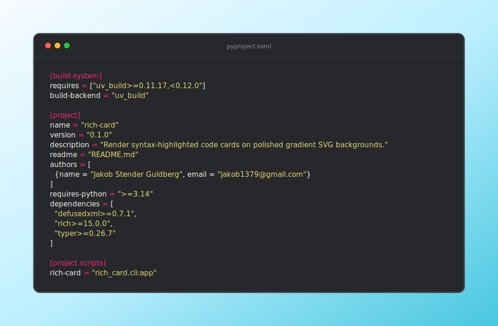

# rich-card

Render syntax-highlighted code, terminal output, and images as polished SVG
terminal cards on gradient backgrounds. The CLI uses Typer for commands and an
in-process Pygments style based on bat's Monokai Extended colors.



## Quick Start

Render a source file or inline snippet:

```bash
rich-card pyproject.toml
rich-card --content 'print("hi")' --lexer python -o hello.svg
```

Piped terminal output is read from stdin. ANSI colors are preserved, and eza
icons render when a Nerd Font such as Symbols Nerd Font Mono is installed:

```bash
eza --tree --icons=always --git-ignore --colour=always src/ | rich-card --title tree -o tree.svg
```

Images can be framed in the same card style:

```bash
rich-card --image screenshot.png --title "Build result" --inner-padding 24 -o screenshot-card.svg
```

Cards auto-size to their content by default. Pass `--width` when you want a
fixed canvas width. Use `--background-padding` for the outer gradient margin and
`--inner-padding` for the padding inside the terminal card:

```bash
rich-card --content 'print("hi")' --width 1080 --background-padding 80 --inner-padding 32 -o fixed-card.svg
```

## Generated Assets

`card.svg` and this README are generated together:

```bash
uv run python scripts/update_generated_docs.py
```

The Nix development shell installs a pre-commit hook that runs the same command
before each commit, so the preview and CLI reference stay in sync with the code.

## CLI Reference

### `rich-card`

**Usage**:

```console
$ rich-card [OPTIONS] [SOURCE]
```

**Arguments**:

- `[SOURCE]`: Optional source file. Omit to read from stdin.

**Options**:

- `-c, --content TEXT`: Inline code content. Takes precedence over SOURCE.
- `--image FILE`: Image file to render inside the card. Supports PNG, JPEG, and
  SVG.
- `-o, --output FILE`: SVG file to write. [default: card.svg]
- `-l, --lexer TEXT`: Pygments lexer name. Defaults to source filename
  inference, or ANSI-aware plain text for stdin.
- `-s, --theme TEXT`: Pygments theme name. See `rich-card --list-themes`.
  [default: monokai-extended]
- `-t, --title TEXT`: Optional card title shown in the card chrome.
- `-b, --background [aurora|blue-raspberry|cosmic-lumen|dusty-grass|ember|electric-twilight|frozen-dream|lagoon|megatron|moss|mono|night-fade|nordic|premium-dark|prism|rainy-ashville|sublime-light|sunny-morning|tempting-azure|warm-flame|winter-neva]`:
  Gradient preset. [default: aurora]
- `-w, --width INTEGER RANGE`: Fixed SVG canvas width in pixels.
  [520&lt;=x&lt;=2400]
- `-p, --padding, --background-padding INTEGER RANGE`: Background padding
  outside the terminal card in pixels. [default: 72; 24&lt;=x&lt;=240]
- `--inner-padding, --terminal-padding INTEGER RANGE`: Padding inside the
  terminal card around the content or image. [0&lt;=x&lt;=160]
- `-r, --radius INTEGER RANGE`: Rounded card corner radius in pixels. [default:
  12; 4&lt;=x&lt;=80]
- `-n, --line-numbers / --no-line-numbers`: Show line numbers. [default:
  no-line-numbers]
- `-W, --word-wrap / --no-word-wrap`: Wrap long lines inside the card. [default:
  no-word-wrap]
- `-T, --tab-size INTEGER RANGE`: Tab expansion width. [default: 2;
  1&lt;=x&lt;=12]
- `--list-themes`: List syntax themes and exit.
- `--help`: Show this message and exit.
